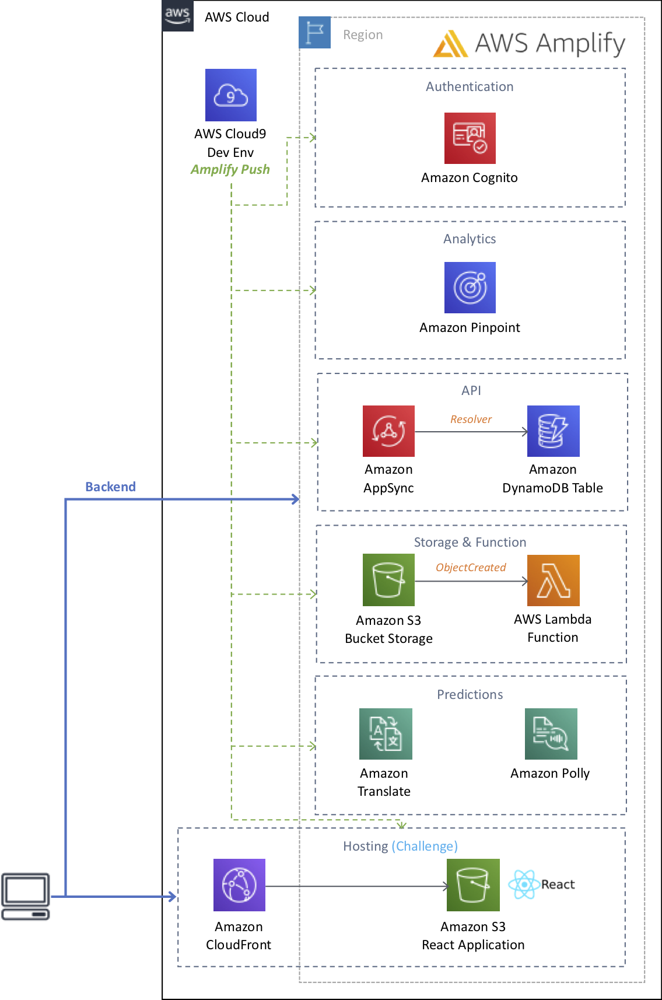

# Deploying a React Application using AWS Amplify

Hello, this is a self-paced workshop to deploy a React application following a continuous integration and delivery model. The application allows users to post "To Do's" with or without pictures. We will use AWS Amplify library to authenticate users with Amazon Cognito, add analytics with Amazon Pinpoint, AWS AppSync to quickly deploy a GraphQL API that saves data in Amazon DynamoDB, manage pictures in Amazon S3 and adding artificial intelligence services such as Amazon Transcribe and Amazon Polly.

See the diagram below for a depiction of the complete architecture.

## AWS Account Required

In order to complete these workshops you'll need a valid active AWS Account with Admin permissions. Use a personal account or create a new AWS account to ensure you have the neccessary access. This should not be an AWS account from the company you work for.

**If the resources that you use for this workshop are left undeleted you will incur charges on your AWS account.**

## To start

Visit the portal to get started: http://aws-react-amplify.ws.kabits.com

## Modules

You must complete the following modules in **US East (N. Virginia)** region in order before proceeding to the next:

- [Preparing your development environment](docs/preparing-your-development-environment.md "Preparing your development environment")
- [Adding Authentication](docs/adding-authentication.md "Adding Authentication")
- [Adding Analytics](docs/adding-analytics.md "Adding Analytics")
- [Creating a GraphQL API](docs/adding-api.md "Creating a GraphQL API")
- [Adding Storage](docs/adding-storage.md "Adding Storage")
- [Add Translate Text and Text to Speech](docs/adding-predictions.md "Add Translate Text and Text to Speech")
- [Adding Hosting](docs/adding-hosting.md "Adding Hosting")