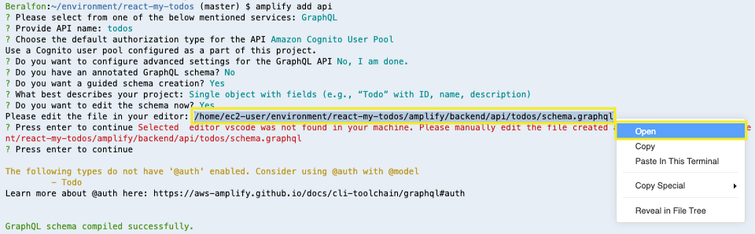
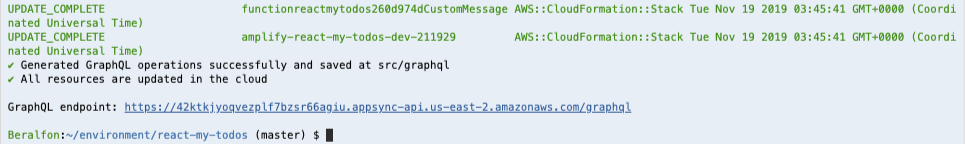
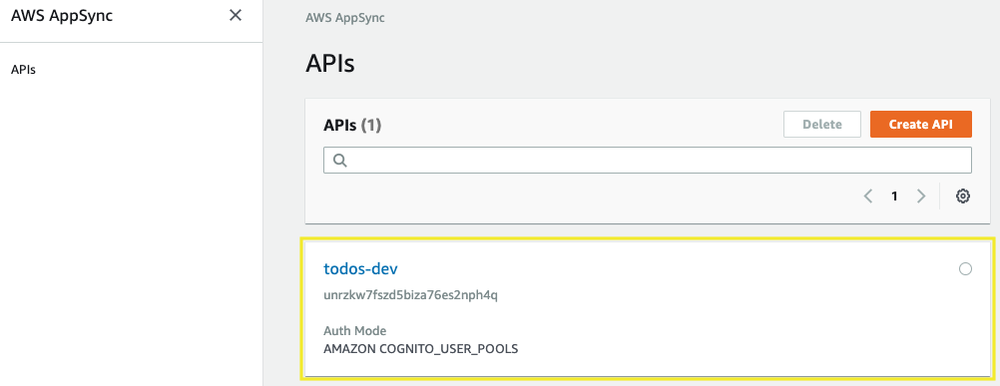
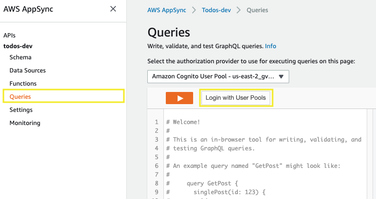
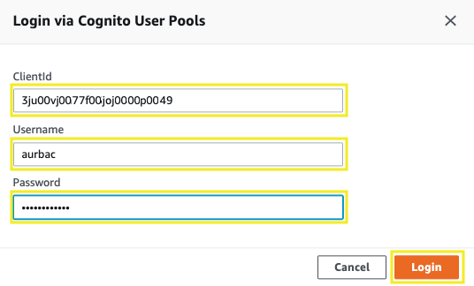
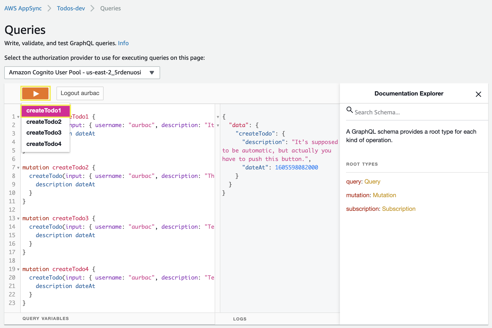
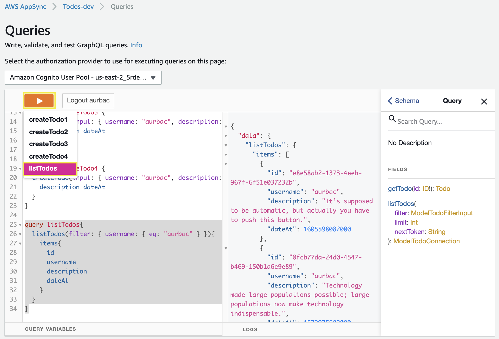
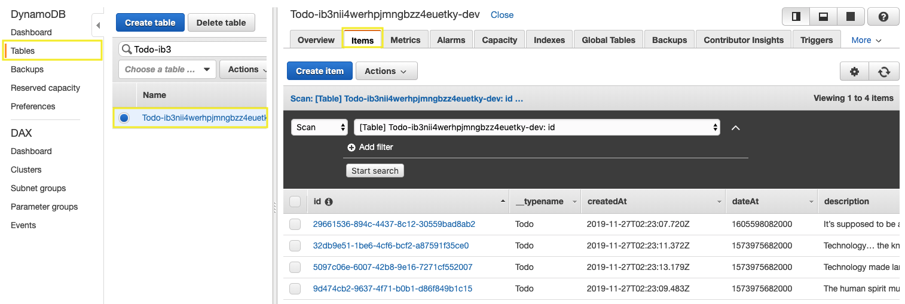

# Creating a GraphQL API

## 1. Creating a GraphQL API with Amplify

1.1\. Using the Amplify CLI create a GraphQL API using the following values.

``` bash
amplify add api
```

? Please select from one of the below mentioned services: **GraphQL**

? Provide API name: **todos**

? Choose the default authorization type for the API **Amazon Cognito User Pool**

Use a Cognito user pool configured as a part of this project.

? Do you want to configure advanced settings for the GraphQL API **No, I am done.**

? Do you have an annotated GraphQL schema? **No**

? Do you want a guided schema creation? **Yes**

? What best describes your project: **Single object with fields (e.g., “Todo” with ID, name, description)**

? Do you want to edit the schema now? **Yes**

Please edit the file in your editor: **/home/ec2-user/environment/react-my-todos/amplify/backend/api/todos/schema.graphql**

? Press enter to continue Selected  editor vscode was not found in your machine. Please manually edit the file created at /home/ec2-user/environment/react-my-todos/amplify/backend/api/todos/schema.graphql

? **Press enter to continue **

1.2\. Manually edit the file created, you can mouse-over the file name in the terminal, click it, and select **Open**.



1.3\. Replace the example schema content with the following and save the file.

```
type Todo @model {
  id: ID!
  username: String!
  description: String!
  dateAt: Float!
  image: String
}
```

1.4\. Push to create these changes in the cloud.

``` bash
amplify push
```

? Are you sure you want to continue? **Yes**

GraphQL schema compiled successfully.

? Do you want to generate code for your newly created GraphQL API **Yes**

? Choose the code generation language target **javascript**

? Enter the file name pattern of graphql queries, mutations and subscriptions **`src/graphql/**/*.js`** (Use default value)

? Do you want to generate/update all possible GraphQL operations - queries, mutations and subscriptions **Yes**

? Enter maximum statement depth [increase from default if your schema is deeply nested] **2**

⠏ Updating resources in the cloud. This may take a few minutes...



**Congratulations! You’ve just created the GraphQL API.**

## 2. Trying out some mutations and queries

2.1\. Open the AWS AppSync console at https://console.aws.amazon.com/appsync/ and click on **todos-prod** API.



2.2\. Click on **Queries** in the sidebar on the left and click the **Login with User Pools** button at the top of the query editor, look up the value for the ClientId field.

* In Cloud9, open **src/aws-exports.js**
* Copy the value of the **aws_user_pools_web_client_id** property



2.3\. Paste the value into **ClientId**, enter **your credentials for the user you created in the react application** and click **Login**.



2.4\. Copy/pasting the following, replace with your **username** and try by pressing the orange **play** button to execute the mutations **one by one**.

```
mutation createTodo1 {
  createTodo(input: { username: "YOUR_USER_NAME", description: "It’s supposed to be automatic, but actually you have to push this button.", dateAt: 1605598082000  } ){
    description dateAt
  }
}

mutation createTodo2 {
  createTodo(input: { username: "YOUR_USER_NAME", description: "The human spirit must prevail over technology.", dateAt: 1573975682000  } ){
    description dateAt
  }
}

mutation createTodo3 {
  createTodo(input: { username: "YOUR_USER_NAME", description: "Technology… the knack of so arranging the world that we don’t have to experience it.", dateAt: 1573975682000  } ){
    description dateAt
  }
}

mutation createTodo4 {
  createTodo(input: { username: "YOUR_USER_NAME", description: "Technology made large populations possible; large populations now make technology indispensable.", dateAt: 1573975682000  } ){
    description dateAt
  }
}
```



2.5\. Copy/pasting the following, replace with your **username** and try by pressing the orange **play** button to execute the query.

```
query listTodos{
  listTodos(filter: { username: { eq: "YOUR_USER_NAME" } }){
    items{
      id
      username
      description
      dateAt
    }
  }
}
```


2.6\. Open the Amazon DynamoDB console at https://console.aws.amazon.com/dynamodb/, in **Tables** section, select your table and explore the **Items** inserted.



## 3. Configure React application to use the GraphQL API

3.1\. Update/replace the contents of **src/components/indexTodos.js** with the following.

``` javascript hl_lines="9 10 11 12 13 14 38 46 47 48 49 50 51 52 53 54 55 56 57 58 59 60 66 69 70 71 72 73 74 75 76 77 78"
import React, { useState, useEffect } from "react";
import { makeStyles } from "@material-ui/core/styles";
import { Typography, Fab } from "@material-ui/core";
import { Link } from "react-router-dom";
import AddIcon from "@material-ui/icons/Add";

import ItemTodo from "./itemTodo.js";

import { Auth } from 'aws-amplify'
import { API, graphqlOperation } from 'aws-amplify';
import { listTodos } from '../graphql/queries';
import { deleteTodo } from '../graphql/mutations';
import awsconfig from '../aws-exports';
API.configure(awsconfig);

const useStyles = makeStyles(theme => ({
  margin: {
    margin: theme.spacing(1)
  },
  extendedIcon: {
    marginRight: theme.spacing(1)
  },
  root: {
    display: "flex",
    alignItems: "center"
  },
  wrapper: {
    position: "relative"
  },
  title: {
    paddingTop: theme.spacing(1),
    paddingRight: 20
  }
}));

function IndexTodos() {
  const classes = useStyles();
  const [user, setUser] = useState({});
  useEffect(() => {
    fetchItems();
  }, []);

  const [items, setItems] = useState([]);

  const fetchItems = async () => {
    try {
      const data = await Auth.currentUserPoolUser();
      const userInfo = { username: data.username, ...data.attributes, };
      setUser(userInfo);
      const response = await API.graphql(graphqlOperation(listTodos, {
          limit: 100,
          filter: {
              username: {
                  eq: userInfo.username
              }
          }
      }));
      console.log(response.data.listTodos.items);
      setItems(response.data.listTodos.items);
    } catch (err) { console.log('error: ', err) }
  };

  const handleDelete = event => {
    console.log("onDelete Item");
    console.log(event);
    callDeleteTodo(event);
  };
  
  async function callDeleteTodo(item) {  
    try {
      await API.graphql(graphqlOperation(deleteTodo, { input: { id: item.id } }));
      console.log('todo successfully deleted!');
      const new_items = items.filter(myitem => myitem.id !== item.id);
      setItems(new_items);
    } catch (err) {
      console.log("error: ", err)
    }
  }

  return (
    <div className="IndexTodos">
      <div className={classes.root}>
        <div className={classes.wrapper}>
          <Typography
            variant="h5"
            component="h1"
            gutterBottom
            className={classes.title}
          >
            My Todos
          </Typography>
        </div>
        <div className={classes.wrapper}>
          <Fab
            variant="extended"
            color="secondary"
            aria-label="add"
            className={classes.margin}
            component={Link}
            to="/addTodo"
          >
            <AddIcon className={classes.extendedIcon} />
            Add Todo
          </Fab>
        </div>
      </div>

      <div>
        {items.map(item => (
          <ItemTodo
            key={item.id}
            item={item}
            onDelete={handleDelete}
            date={item.dateAt}
          />
        ))}
      </div>
    </div>
  );
}

export default IndexTodos;
```

3.2\. Update/replace the contents of **src/components/addTodo.js** with the following.

``` javascript hl_lines="1 12 13 14 15 16 41 43 44 45 47 48 49 50 51 52 53 54 61 62 63 64 65 66 67 81"
import React, { useState, useEffect } from "react";
import { makeStyles } from "@material-ui/core/styles";
import { Button, TextField, Typography } from "@material-ui/core";
import { Link } from "react-router-dom";
import { Formik, Form } from "formik";
import * as Yup from "yup";
import DateFnsUtils from "@date-io/date-fns";
import { MuiPickersUtilsProvider, DateTimePicker } from "@material-ui/pickers";
import S3ImageUpload from "./S3ImageUpload.js";
import { useHistory } from "react-router-dom";

import { Auth } from 'aws-amplify'
import { API, graphqlOperation } from 'aws-amplify';
import { createTodo } from '../graphql/mutations';
import awsconfig from '../aws-exports';
API.configure(awsconfig);

const useStyles = makeStyles(theme => ({
  textField: {
    marginTop: theme.spacing(1),
    marginBottom: theme.spacing(1)
  },

  button: {
    marginRight: theme.spacing(1),
    marginTop: theme.spacing(1)
  }
}));

const validationSchema = Yup.object().shape({
  description: Yup.string()
    .min(2, "Must have at least 2 character")
    .max(255, "Must be shorter than 255")
    .required("Must enter a description")
});

function AddTodo() {
  const classes = useStyles();
  const [mySubmitting, setMySubmitting] = useState(false);
  const [selectedDate, setSelectedDate] = useState(new Date());
  const [user, setUser] = useState({});
  let history = useHistory();
  useEffect(() => {
    checkUser();
  }, []);

  async function checkUser() {
    try {
      const data = await Auth.currentUserPoolUser();
      const userInfo = { username: data.username, ...data.attributes, };
      setUser(userInfo);
      console.log(userInfo);
    } catch (err) { console.log('error: ', err) }
  }

  const handleDateChange = date => {
    setSelectedDate(date);
  };
  
  async function callCreateTodo(item) {  
    try {
      await API.graphql(graphqlOperation(createTodo, { input: item }))
      console.log('todo successfully created!')
      history.push("/")
    } catch (err) {
      console.log("error: ", err)
    }
  }

  return (
    <div className="AddTodo">
      <Typography variant="h5" component="h1" gutterBottom>
        Add Todo
      </Typography>
      <Formik
        initialValues={{ description: "" }}
        validationSchema={validationSchema}
        onSubmit={(values, { resetForm }) => {
          console.log(values);
          console.log(selectedDate.getTime());
          callCreateTodo({ username: user.username, description: values.description, dateAt: selectedDate.getTime() });
          setMySubmitting(true);
          resetForm();
        }}
      >
        {({
          values,
          errors,
          touched,
          handleChange,
          handleBlur,
          handleSubmit
          /* and other goodies */
        }) => (
          <Form onSubmit={handleSubmit}>
            <TextField
              id="description"
              name="description"
              label="Description"
              color="primary"
              rows="2"
              rowsMax="4"
              className={classes.textField}
              value={values.description}
              onChange={handleChange}
              onBlur={handleBlur}
              helperText={errors.description ? errors.description : ""}
              fullWidth
              multiline
              variant="outlined"
            />
            <MuiPickersUtilsProvider utils={DateFnsUtils}>
              <div className="pickers">
                <DateTimePicker
                  id="dateAt"
                  name="dateAt"
                  value={selectedDate}
                  className={classes.textField}
                  onChange={handleDateChange}
                  label="Date Time Picker"
                  disablePast
                />
              </div>
            </MuiPickersUtilsProvider>
            <S3ImageUpload />
            <Button
              variant="contained"
              className={classes.button}
              component={Link}
              to="/"
            >
              Cancelar
            </Button>
            <Button
              variant="contained"
              color="primary"
              type="submit"
              disabled={mySubmitting}
              className={classes.button}
            >
              Save
            </Button>
          </Form>
        )}
      </Formik>
    </div>
  );
}

export default AddTodo;
```

3.3\. Update/replace the contents of **src/components/editTodo.js** with the following.

``` javascript hl_lines="12 13 14 15 16 17 43 51 52 53 54 55 56 57 58 59 60 61 69 70 71 72 73 74 75 84 90"
import React, { useState, useEffect } from "react";
import { makeStyles } from "@material-ui/core/styles";
import { Button, TextField, Typography } from "@material-ui/core";
import { Link } from "react-router-dom";
import { Formik, Form } from "formik";
import * as Yup from "yup";
import DateFnsUtils from "@date-io/date-fns";
import { MuiPickersUtilsProvider, DateTimePicker } from "@material-ui/pickers";
import S3ImageUpload from "./S3ImageUpload.js";
import { useHistory } from "react-router-dom";

import { Auth } from 'aws-amplify'
import { API, graphqlOperation } from 'aws-amplify';
import { getTodo } from '../graphql/queries';
import { updateTodo } from '../graphql/mutations';
import awsconfig from '../aws-exports';
API.configure(awsconfig);

const useStyles = makeStyles(theme => ({
  textField: {
    marginTop: theme.spacing(1),
    marginBottom: theme.spacing(1)
  },

  button: {
    marginRight: theme.spacing(1),
    marginTop: theme.spacing(1)
  }
}));

const validationSchema = Yup.object().shape({
  description: Yup.string()
    .min(2, "Must have at least 2 character")
    .max(255, "Must be shorter than 255")
    .required("Must enter a description")
});

function EditTodo(props) {
  const classes = useStyles();
  const [mySubmitting, setMySubmitting] = useState(false);
  const [selectedDate, setSelectedDate] = useState(new Date());
  const [item, setItem] = useState({ id: "", username: "", description: "", dateAt: "", image: null });
  const [user, setUser] = useState({});
  let history = useHistory();
  useEffect(() => {
    fetchItem();
  }, []);

  const fetchItem = async () => {
    console.log(props.match.params.idTodo);
    try {
      const data = await Auth.currentUserPoolUser();
      const userInfo = { username: data.username, ...data.attributes, };
      setUser(userInfo);
      const response = await API.graphql(graphqlOperation(getTodo, {
          id: props.match.params.idTodo
      }));
      console.log(response.data.getTodo.dateAt);
      setSelectedDate(new Date(response.data.getTodo.dateAt));
      setItem({ id:response.data.getTodo.id, username: response.data.getTodo.username, description: response.data.getTodo.description });
    } catch (err) { console.log('error: ', err) }
  };

  const handleDateChange = date => {
    setSelectedDate(date);
  };
  
  async function callEditTodo(item) {  
    try {
      await API.graphql(graphqlOperation(updateTodo, { input: item }))
      console.log('todo successfully updated!')
      history.push("/")
    } catch (err) {
      console.log("error: ", err)
    }
  }

  return (
    <div className="EditTodo">
      <Typography variant="h5" component="h1" gutterBottom>
        Edit Todo
      </Typography>
      <Formik
        enableReinitialize
        initialValues={{ description: item.description }}
        validationSchema={validationSchema}
        onSubmit={(values, { resetForm }) => {
          console.log(values);
          console.log(selectedDate.getTime());
          callEditTodo({ id: item.id, username: user.username, description: values.description, dateAt: selectedDate.getTime(), image: null });
          setMySubmitting(true);
          resetForm();
        }}
      >
        {({
          values,
          errors,
          touched,
          handleChange,
          handleBlur,
          handleSubmit
          /* and other goodies */
        }) => (
          <Form onSubmit={handleSubmit}>
            <TextField
              id="description"
              name="description"
              label="Description"
              color="primary"
              rows="2"
              rowsMax="4"
              className={classes.textField}
              value={values.description}
              onChange={handleChange}
              onBlur={handleBlur}
              helperText={errors.description ? errors.description : ""}
              fullWidth
              multiline
              variant="outlined"
            />
            <MuiPickersUtilsProvider utils={DateFnsUtils}>
              <div className="pickers">
                <DateTimePicker
                  id="dateAt"
                  name="dateAt"
                  value={selectedDate}
                  className={classes.textField}
                  onChange={handleDateChange}
                  label="Date Time Picker"
                  disablePast
                />
              </div>
            </MuiPickersUtilsProvider>
            <S3ImageUpload />
            <Button
              variant="contained"
              className={classes.button}
              component={Link}
              to="/"
            >
              Cancelar
            </Button>
            <Button
              variant="contained"
              color="primary"
              type="submit"
              disabled={mySubmitting}
              className={classes.button}
            >
              Save
            </Button>
          </Form>
        )}
      </Formik>
    </div>
  );
}

export default EditTodo;
```

3.4\. **Adding**, **committing**, and **pushing** files to the CodeCommit repository.

``` bash
git add .
git commit -m "API added"
git push origin master
```

3.5\. Go back to your application running, now you can retrieve, create, edit and delete a todos from the DynamoDB table.