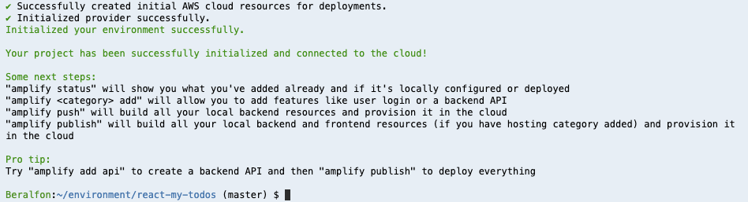
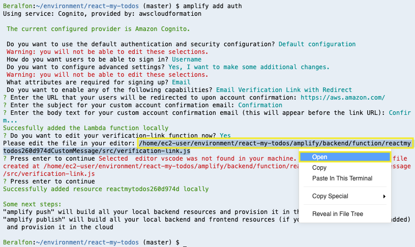
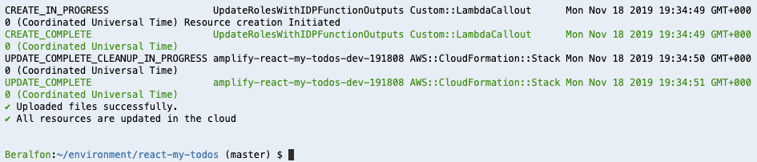
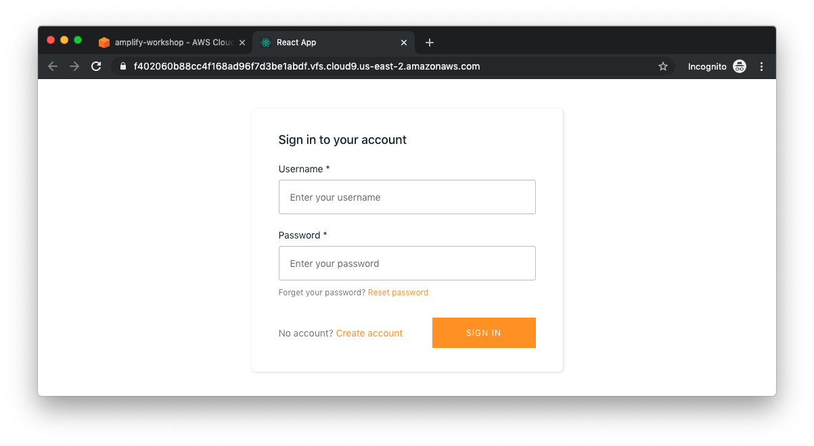
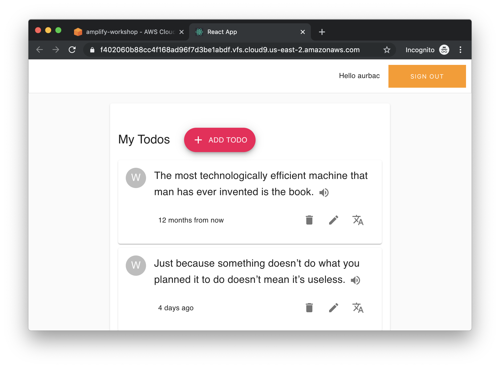

# Adding Authentication

Now that we have a simple React app, let’s let users sign up and sign in to our app. They won’t be able to do anything yet, but it will be helpful to have this in place so that when we add in the ability to query our backend API, we’ll know which users are accessing our system.

## 1. Initializing Amplify

1.1\. Install Amplify CLI tool https://github.com/aws-amplify/amplify-cli

``` bash
npm install -g @aws-amplify/cli
```

1.2\. Adde the **aws-amplify** and **aws-amplify-react** modules to your React application.

``` bash
cd ~/environment/react-my-todos/
npm install --save aws-amplify@2.2.4 aws-amplify-react@3.1.5
```

1.3\. Initialize the Amplify project and use the following values.

``` bash
amplify init
```

? Enter a name for the project **react-my-todos**

? Enter a name for the environment **prod**

? Choose your default editor: **Visual Studio Code**

? Choose the type of app that you're building **javascript**

Please tell us about your project

? What javascript framework are you using **react**

? Source Directory Path:  **src**

? Distribution Directory Path: **build**

? Build Command:  **npm run-script build**

? Start Command: **npm run-script start**

Using default provider  awscloudformation


For more information on AWS Profiles, see:

https://docs.aws.amazon.com/cli/latest/userguide/cli-multiple-profiles.html


? Do you want to use an AWS profile? **Yes**

? Please choose the profile you want to use **default**



## 2. Adding Amplify authentication

2.1\. Using the Amplify CLI add authentication to the application and use the following values.

``` bash
amplify add auth
```

 Do you want to use the default authentication and security configuration? **Default configuration**

 Warning: you will not be able to edit these selections. 

 How do you want users to be able to sign in? **Username**

 Do you want to configure advanced settings? **Yes, I want to make some additional changes.**

 Warning: you will not be able to edit these selections. 

 What attributes are required for signing up? **Email**

 Do you want to enable any of the following capabilities? **Email Verification Link with Redirect** (Tap spacebar to checkbox select)

? Enter the URL that your users will be redirected to upon account confirmation: **https://aws.amazon.com/**

? Enter the subject for your custom account confirmation email: **Confirmation**

? Enter the body text for your custom account confirmation email (this will appear before the link URL): **Confirm...**

Succesfully added the Lambda function locally

? Do you want to edit your verification-link function now? **Yes**

Please edit the file in your editor: **/home/ec2-user/environment/react-my-todos/amplify/backend/function/reactmytodos1c127207CustomMessage/src/verification-link.js**

? Press enter to continue Selected  editor vscode was not found in your machine. Please manually edit the file created at /home/ec2-user/environment/react-my-todos/amplify/backend/function/reactmytodos1c127207CustomMessage/src/verification-link.js

? **Press enter to continue **

2.2\. Once you finish the settings you can open the **verification-link** file to review the settings by clicking the URL file and **Open**.



2.3\. Push to create these changes in the cloud.

``` bash
amplify push
```

? Are you sure you want to continue? **Yes**

⠏ Updating resources in the cloud. This may take a few minutes...



!!! info
    The Amplify CLI will take care of provisioning the appropriate cloud resources and it will update src/aws-exports.js with all of the configuration data we need to be able to use the cloud resources in our app.

**Congratulations! You’ve just created a serverless backend for user registration and authorization capable of scaling to millions of users with Amazon Cognito.**

## 3. Configure React application with authentication

3.1\. Update the contents of **src/App.js** with the following.

``` javascript hl_lines="11 12 13 14 49"
import React from "react";
import { makeStyles } from "@material-ui/core/styles";
import CssBaseline from "@material-ui/core/CssBaseline";
import Container from "@material-ui/core/Container";
import IndexTodos from "./components/indexTodos.js";
import AddTodo from "./components/addTodo.js";
import EditTodo from "./components/editTodo.js";
import Paper from "@material-ui/core/Paper";
import { BrowserRouter as Router, Switch, Route } from "react-router-dom";

import { Auth } from 'aws-amplify';
import awsconfig from './aws-exports';
import { withAuthenticator } from 'aws-amplify-react';
Auth.configure(awsconfig);

const useStyles = makeStyles(theme => ({
  root: {
    padding: theme.spacing(5, 2)
  }
}));

function App() {
  const classes = useStyles();

  return (
    <div className="App">
      <Router>
        <React.Fragment>
          <CssBaseline />
          <Container
            fixed
            maxWidth="sm"
            style={{ height: "100vh", paddingTop: 20 }}
          >
            <Paper className={classes.root}>
              <Switch>
                <Route path="/" exact component={IndexTodos} />
                <Route path="/addTodo" component={AddTodo} />
                <Route path="/editTodo/:idTodo" component={EditTodo} />
              </Switch>
            </Paper>
          </Container>
        </React.Fragment>
      </Router>
    </div>
  );
}

export default withAuthenticator(App, {includeGreetings: true});
```

3.2\. **Adding**, **committing**, and **pushing** files to the CodeCommit repository.

``` bash
git add .
git commit -m "Authentication added"
git push origin master
```

3.3\. Go back to your application running and create an account in the app by providing a username, password, and a valid email address (to receive a confirmation code at).



**What we changed in App.js**

* Imported and configured the AWS Amplify JS library
* Imported the withAuthenticator higher order component from aws-amplify-react
* Wrapped the App component using withAuthenticator

3.4\. Check your email. You should have received a confirmation link and after the validation you should then be able to log in with the username and password you entered during sign up.

3.5\. Once you sign in, the form disappears and you can see our App component rendered below a header bar that contains your username and a **Sign Out** button.

