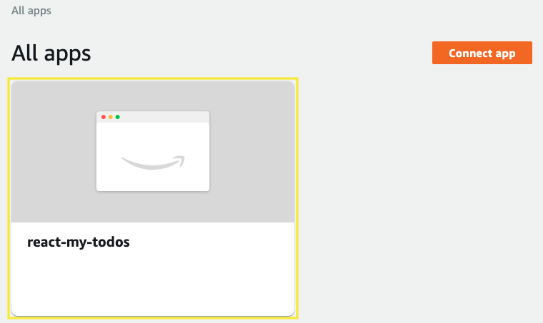
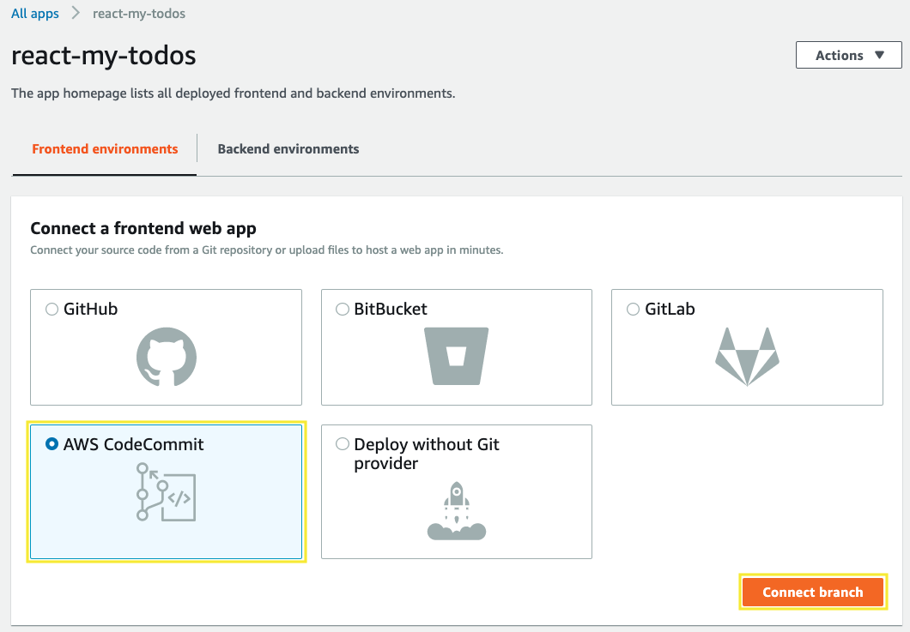
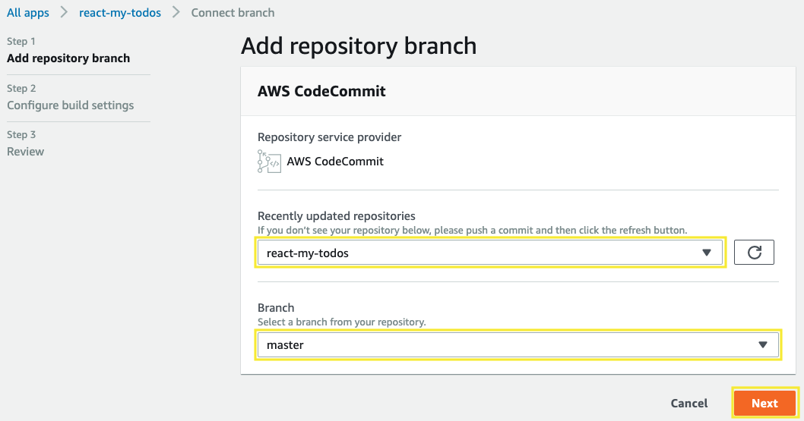
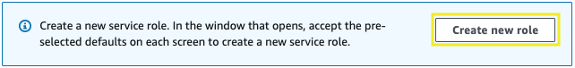
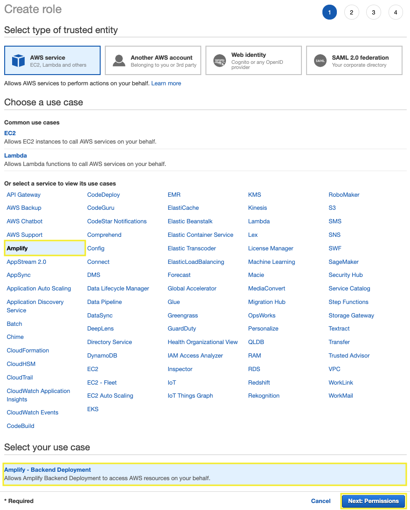
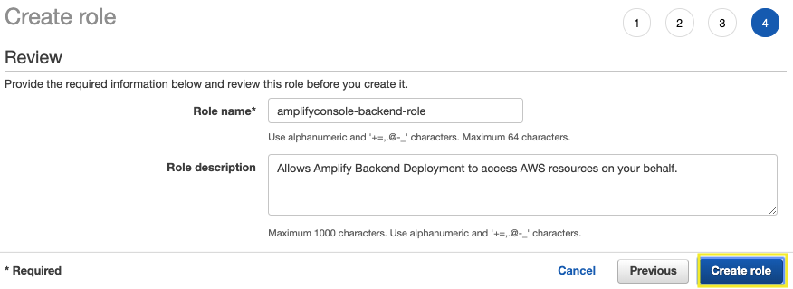
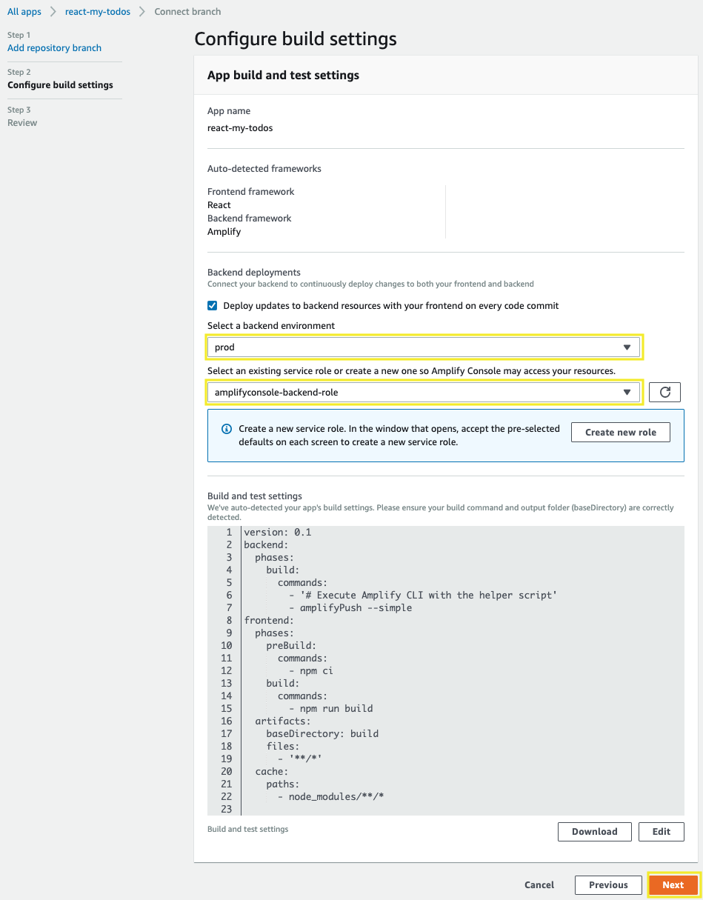
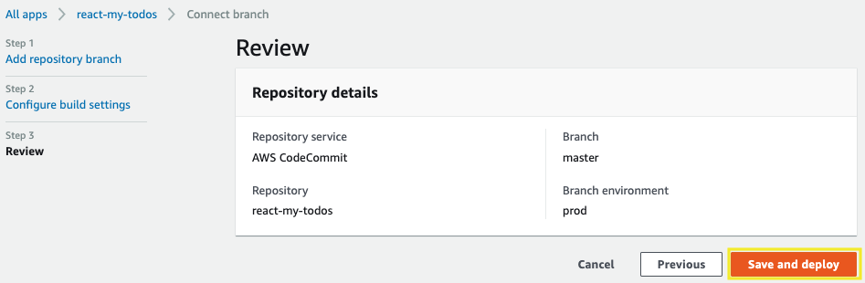
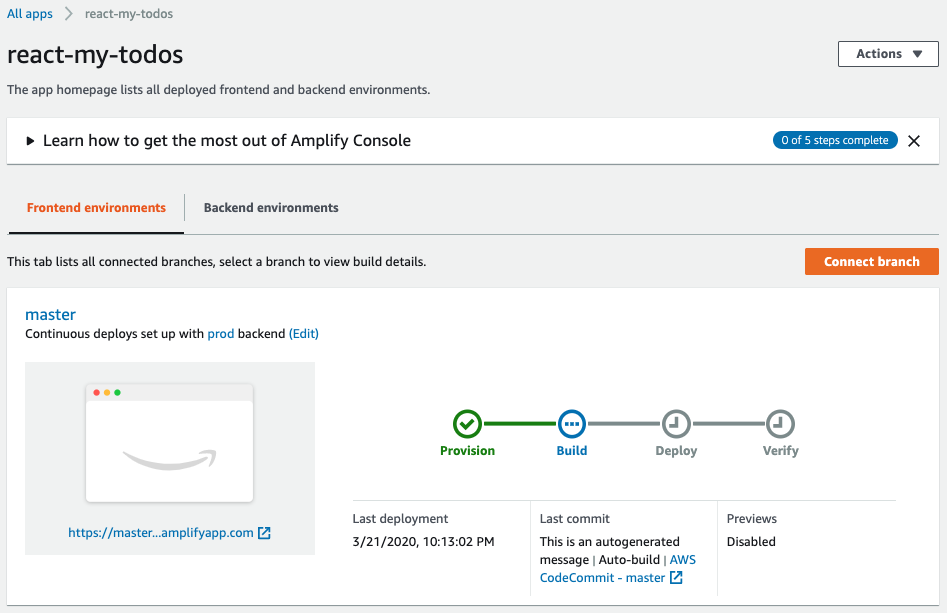
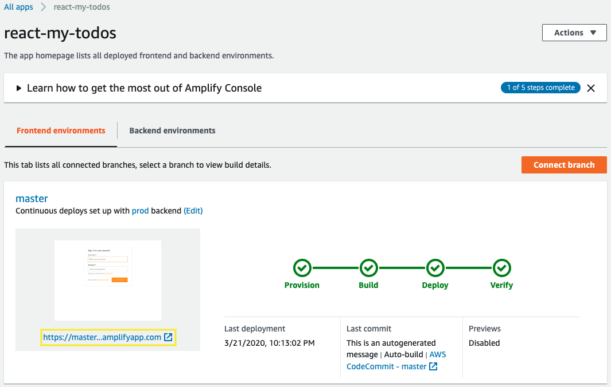

# Adding Hosting

The AWS Amplify Console makes it easy to continuously build, deploy, and host a modern web app.

## 1. Adding hosting to your modern web application

1.1\. Open the Amplify console at https://console.aws.amazon.com/amplify/home.

1.2\. Choose your app **react-my-todos**.



1.3\. Select **AWS CodeCommit** as your source code git respository and click **Connect branch**.



1.4\. Select your respository **react-my-todos** and for branch select **master**, click **Next**.



1.5\. For the **Configure build settings** section choose **Create new role** for backend deployments.



1.6\. Choose **Amplify** from the list of services, scroll down and choose **Amplify - Backend Deployment** that allows Amplify to call AWS services on your behalf for your use case, then **Next: Permissions**.



1.7\. For **attach permissions policies** the policy is selected by default, choose **Next: Tags**.


1.8\. For **Add tags** choose **Next: Review**.

1.9\. Choose **Create Role**.



1.10\. Return to **Configure build settings** section, select your backend environment **prod** and select your role created **amplifyconsole-backend-role**, choose **Next**.



1.11\. Choose **Save and deploy** to deploy your web app to a global content delivery network (CDN).



1.12\. Your front end build typically takes 1 to 2 minutes but can vary based on size of the app.



!!! info
    A build has the following stages:

    **Provision** - Your build environment is set up using a Docker image on a host with 4 vCPU, 7GB memory. Each build gets its own host instance, ensuring that all resources are securely isolated. The contents of the Docker file are displayed to ensure that the default image supports your requirements.

    **Build** - The build phase consists of three stages: setup (clones repository into container), deploy backend (runs the Amplify CLI to deploy backend resources), and build front end (builds your front-end artifacts).

    **Deploy** - When the build is complete, all artifacts are deployed to a hosting environment managed by Amplify. Every deployment is atomic - atomic deployments eliminate maintenance windows by ensuring that the web app is only updated after the entire deployment has completed.

    **Verify** - To verify that your app works correctly, Amplify renders screen shots of the index.html in multiple device resolutions using Headless Chrome.

1.13\. Once completed, click on the site image to launch your app.



## 2. Modify the website

The AWS Amplify Console will rebuild and redeploy the app when it detects changes to the connected repository. Make a change to the main page to test out this process.

2.1\. From your Cloud9 environment open the **public/index.html** file in the root directory of the repository **react-my-todos**.

2.2\. Modify the title line with the following.

``` html
<title>My Todos</title>
```

2.3\. **Adding**, **committing**, and **pushing** files to the CodeCommit repository.

``` bash
git add .
git commit -m "Title change"
git push origin master
```

!!! info
    Amplify Console will begin to build the site again soon after it notices the update to the repository. It will happen pretty quickly! Head back to the Amplify Console console page to watch the process.

!!! done
    **Congratulations!!!** Now you have a modern application deployed using AWS Amplify.