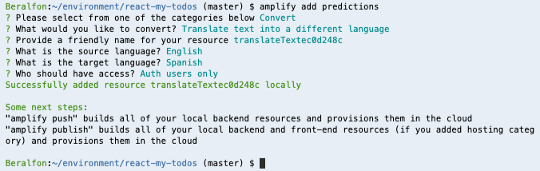
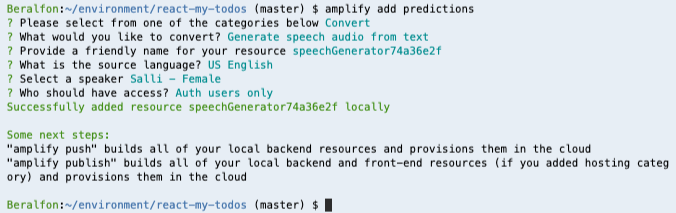
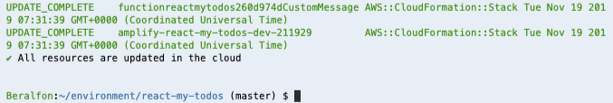

# Add Translate Text and Text to Speech

## 1. Adding Amplify predictions

1.1\. Using the Amplify CLI add predictions to **Translate Text (English to Spanish)**, use the following values.

``` bash
amplify add predictions
```

? Please select from one of the categories below **Convert**

? What would you like to convert? **Translate text into a different language**

? Provide a friendly name for your resource **translateTextec0d248c** (Use default value)

? What is the source language? **English**

? What is the target language? **Spanish**

? Who should have access? **Auth users only**



1.2\. Using the Amplify CLI add predictions to **Speech audio from Text (English)**, use the following values.

``` bash
amplify add predictions
```

? Please select from one of the categories below **Convert**

? What would you like to convert? **Generate speech audio from text**

? Provide a friendly name for your resource **speechGenerator74a36e2f** (Use default value)

? What is the source language? **US English**

? Select a speaker **Salli - Female**

? Who should have access? **Auth users only**



1.3\. Push to create these changes in the cloud.

``` bash
amplify push
```

? Are you sure you want to continue? **Yes**



**Congratulations! You’ve just added AI to your application.**

## 2. Configure React application to use Translate and Speech audio from Text

2.1\. Update/replace the contents of **src/components/itemTodo.js** with the following.

``` javascript hl_lines="20 21 26 27 60 61 62 63 64 65 66 67 68 69 70 71 72 73 74 75 76 77 78 84 85 86 87 88 89 90 91 92 93 94 95 96 97 98 99 100 101 102 103 104 119 120 121 122 123 124 125 126 127 128"
import React, { useState } from "react";
import { makeStyles } from "@material-ui/core/styles";
import {
  IconButton,
  Grid,
  Avatar,
  Card,
  Typography,
  CardActions,
  Divider
} from "@material-ui/core";
import TimeAgo from "react-timeago";
import clsx from "clsx";
import VolumeUpIcon from "@material-ui/icons/VolumeUp";
import TranslateIcon from "@material-ui/icons/Translate";
import EditIcon from "@material-ui/icons/Edit";
import DeleteIcon from "@material-ui/icons/Delete";
import { useHistory } from "react-router-dom";

import Amplify, {Predictions} from 'aws-amplify';
import {AmazonAIPredictionsProvider} from '@aws-amplify/predictions';
import { S3Image } from 'aws-amplify-react';
import Analytics from '@aws-amplify/analytics';
import awsconfig from '../aws-exports';
Analytics.configure(awsconfig);
Amplify.configure(awsconfig);
Amplify.addPluggable(new AmazonAIPredictionsProvider());

const useStyles = makeStyles(theme => ({
  itemTodo: {
    padding: 15,
    marginTop: theme.spacing(1)
  },
  button: {
    marginTop: theme.spacing(1)
  },
  listen: {
    marginLeft: 5
  },
  translate: {
    marginTop: 15
  },
  expand: {
    marginLeft: "auto"
  },
  expandOpen: {
    transform: "rotate(180deg)"
  }
}));

function ItemTodo(props) {
  console.log(props);
  const classes = useStyles();
  const [showTranslate, setShowTranslate] = useState(false);
  const [translatedText, setTranlatedText] = useState("");
  let history = useHistory();

  const handleClickListenOriginal = event => {
    console.log("Listen Original");
    Predictions.convert({
      textToSpeech:{
        source:{
          text:props.item.description
        }
      }
    })
    .then(result => {
      let AudioContext = window.AudioContext || window.webkitAudioContext;
      console.log({ AudioContext });
      const audioCtx = new AudioContext(); 
      const source = audioCtx.createBufferSource();
      audioCtx.decodeAudioData(result.audioStream, (buffer) => {
        source.buffer = buffer;
        source.connect(audioCtx.destination);
        source.start(0);
      }, (err) => console.log({err}));
    })
    .catch(err => console.log(err));
    sendSpeechAnalytics("English");
  };

  const handleClickListenTranslate = event => {
    console.log("Listen Translate");
    Predictions.convert({
      textToSpeech:{
        source:{
          text:translatedText
        },
        voiceId: "Mia",
        languageCode: "es-MX"
      }
    })
    .then(result => {
      let AudioContext = window.AudioContext || window.webkitAudioContext;
      console.log({ AudioContext });
      const audioCtx = new AudioContext(); 
      const source = audioCtx.createBufferSource();
      audioCtx.decodeAudioData(result.audioStream, (buffer) => {
        source.buffer = buffer;
        source.connect(audioCtx.destination);
        source.start(0);
      }, (err) => console.log({err}));
    })
    .catch(err => console.log(err));
    sendSpeechAnalytics("Spanish");
  };

  const handleClickEdit = event => {
    console.log("Edit todo");
    history.push("/editTodo/" + props.item.id);
  };

  const handleClickTranslate = event => {
    if (showTranslate) {
      setShowTranslate(false);
      setTranlatedText("");
    } else {
      setShowTranslate(true);
      Predictions.convert({
        translateText: {
          source: {
            text: props.item.description,
            // language : "es" // defaults configured on aws-exports.js
            // supported languages https://docs.aws.amazon.com/translate/latest/dg/how-it-works.html#how-it-works-language-codes
          },
        }
      }).then(result => setTranlatedText(result.text))
        .catch(err => setTranlatedText(JSON.stringify(err, null, 2)));
      sendTranslateAnalytics();
    }
  };
  
  const sendTranslateAnalytics = async () => {
    Analytics.record({ name: 'translate' }).then( (evt) => {
            console.log("Event Submitted" + JSON.stringify(evt));
        });
  };

  const sendSpeechAnalytics = async (value) => {
    Analytics.record({ name: 'speech', attributes: { lang: value } }).then( (evt) => {
            console.log("Event Submitted" + JSON.stringify(evt));
        });
  };

  return (
    <Card className={classes.itemTodo}>
      <Grid container wrap="nowrap" spacing={2}>
        <Grid item>
          <Avatar>
             <S3Image 
                imgKey={props.item.image}
                theme={{ photoImg: { height: '42px' } }}
                style={{display: 'inline-block', 'paddingRight': '5px'}}
              />
          </Avatar>
        </Grid>
        <Grid item xs zeroMinWidth>
          <Typography variant="h6" gutterBottom>
            {props.item.description}
            <IconButton
              id="listenOriginal"
              className={classes.listen}
              aria-label="Listen"
              size="small"
              onClick={handleClickListenOriginal}
            >
              <VolumeUpIcon />
            </IconButton>
          </Typography>
          <div style={showTranslate ? {} : { display: "none" }}>
            <Divider />
            <Typography variant="h6" gutterBottom className={classes.translate}>
              {translatedText}
              <IconButton
                id="listenTranslate"
                className={classes.listen}
                aria-label="Listen"
                size="small"
                onClick={handleClickListenTranslate}
              >
                <VolumeUpIcon />
              </IconButton>
            </Typography>
          </div>
          <CardActions disableSpacing>
            <TimeAgo date={props.item.dateAt} className={classes.dateAt} />
            <IconButton
              className={clsx(classes.expand)}
              aria-label="Delete"
              onClick={() => props.onDelete(props.item)}
            >
              <DeleteIcon />
            </IconButton>
            <IconButton aria-label="Edit" onClick={handleClickEdit}>
              <EditIcon />
            </IconButton>
            <IconButton aria-label="Translate" onClick={handleClickTranslate}>
              <TranslateIcon />
            </IconButton>
          </CardActions>
        </Grid>
      </Grid>
    </Card>
  );
}

export default ItemTodo;
```

2.2\. **Adding**, **committing**, and **pushing** files to the CodeCommit repository.

``` bash
git add .
git commit -m "Predictions added"
git push origin master
```

2.3\. Go back to your application running, now you translate and speech todos.