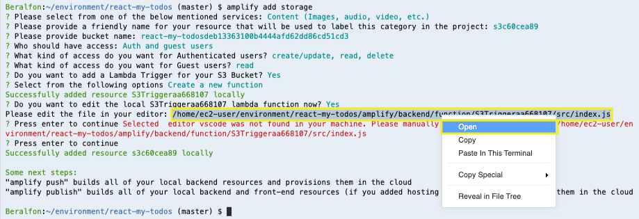

# Adding Storage

We’ll need a place to store photos that get uploaded to our todos. Amazon Simple Storage Service (S3) is a great option for this and Amplify’s Storage module makes setting up and working with S3 very easy.

## 1. Adding Amplify storage

1.1\. Using the Amplify CLI add storage, use the following values.

``` bash
amplify add storage
```

? Please select from one of the below mentioned services: **Content (Images, audio, video, etc.)**

? Please provide a friendly name for your resource that will be used to label this category in the project: **s3c60cea89** (Use default value)

? Please provide bucket name: **react-my-todosdeb13363100b4444afd62dd86cd51cd3** (Use default value)

? Who should have access: **Auth and guest users**

? What kind of access do you want for Authenticated users? **create/update, read, delete** (Tap spacebar to checkbox select)

? What kind of access do you want for Guest users? **read** (Tap spacebar to checkbox select)

? Do you want to add a Lambda Trigger for your S3 Bucket? **Yes**

? Select from the following options **Create a new function**

Successfully added resource S3Triggeraa668107 locally

? Do you want to edit the local S3Triggeraa668107 lambda function now? **Yes**

Please edit the file in your editor: /home/ec2-user/environment/react-my-todos/amplify/backend/function/S3Triggerff25f09f/src/index.js

? Press enter to continue Selected  editor vscode was not found in your machine. Please manually edit the file created at /home/ec2-user/environment/react-my-todos/amplify/backend/function/S3Triggerff25f09f/src/index.js

? **Press enter to continue**

1.2\. Optionally, you can open the **index.js** file.



1.3\. Push to create these changes in the cloud.

``` bash
amplify push
```

? Are you sure you want to continue? **Yes**

**Congratulations! You’ve just added Storage to your application.**

## 2. Configure React application to storage for your images

2.1\. Update/replace the contents of **src/components/S3ImageUpload.js** with the following.

``` javascript hl_lines="5 6 7 8 13 17 18 19 20 21 22 23 24 25 26 27 28 29 30 31 32 36 37 38 39 40 67 68 69 70 71 72"
import React, { Component } from "react";
import { Button, Avatar } from "@material-ui/core";
import { v4 as uuid } from "uuid";

import { Auth, Storage } from 'aws-amplify';
import { S3Image } from 'aws-amplify-react';
import awsconfig from '../aws-exports'
Storage.configure(awsconfig);

export default class S3ImageUpload extends Component {
  constructor(props) {
    super(props);
    this.state = { uploading: false, path: "" };
  }

  uploadFile = async file => {
    let fileName = uuid();
    const name_s = file.name.split(".");
    const extension = name_s[name_s.length-1];
    fileName = fileName + "." + extension.toLowerCase();
    const data = await Auth.currentUserPoolUser();
    const image_prefix = 'uploads/'+data.username+"/";
    const result = await Storage.put(
      image_prefix+fileName, 
      file, 
      {
        metadata: { owner: data.username }
      }
    );
    console.log('Uploaded file: ', JSON.stringify(result));
    this.setState({ path: image_prefix+fileName });
    console.log(this.state.path);
  };

  onChange = async e => {
    let files = [];
    for (var i=0; i<e.target.files.length; i++) {
      files.push(e.target.files.item(i));
    }
    await Promise.all(files.map(f => this.uploadFile(f)));
    this.setState({ uploading: true });
  };

  render() {
    return (
      <div style={{ marginTop: 10, marginBottom: 10 }}>
        <Button
          variant="contained"
          onClick={() =>
            document.getElementById("add-image-file-input").click()
          }
          disabled={this.state.uploading}
          icon="file image outline"
          content={this.state.uploading ? "Uploading..." : "Add Images"}
        >
          Select Image
        </Button>
        <input
          id="add-image-file-input"
          type="file"
          accept="image/jpeg"
          //multiple
          onChange={this.onChange}
          style={{ display: "none" }}
        />
        <Avatar alt="Image" style={{ width: 140, height: 140, marginTop: 15 }}>
         <S3Image 
            imgKey={this.state.path}
            onLoad={this.props.onLoadImage(this.state.path)}
            theme={{ photoImg: { height: '140px' } }}
            style={{display: 'inline-block', 'paddingRight': '5px'}}
          />
        </Avatar>
      </div>
    );
  }
}
```

2.2\. Update/replace the contents of **src/components/addTodo.js** with the following.

``` javascript hl_lines="42 71 72 73 74 75 88 132"
import React, { useState, useEffect } from "react";
import { makeStyles } from "@material-ui/core/styles";
import { Button, TextField, Typography } from "@material-ui/core";
import { Link } from "react-router-dom";
import { Formik, Form } from "formik";
import * as Yup from "yup";
import DateFnsUtils from "@date-io/date-fns";
import { MuiPickersUtilsProvider, DateTimePicker } from "@material-ui/pickers";
import S3ImageUpload from "./S3ImageUpload.js";
import { useHistory } from "react-router-dom";

import { Auth } from 'aws-amplify'
import { API, graphqlOperation } from 'aws-amplify';
import { createTodo } from '../graphql/mutations';
import awsconfig from '../aws-exports';
API.configure(awsconfig);

const useStyles = makeStyles(theme => ({
  textField: {
    marginTop: theme.spacing(1),
    marginBottom: theme.spacing(1)
  },

  button: {
    marginRight: theme.spacing(1),
    marginTop: theme.spacing(1)
  }
}));

const validationSchema = Yup.object().shape({
  description: Yup.string()
    .min(2, "Must have at least 2 character")
    .max(255, "Must be shorter than 255")
    .required("Must enter a description")
});

function AddTodo() {
  const classes = useStyles();
  const [mySubmitting, setMySubmitting] = useState(false);
  const [selectedDate, setSelectedDate] = useState(new Date());
  const [user, setUser] = useState({});
  const [image, setImage] = useState("");
  let history = useHistory();
  useEffect(() => {
    checkUser();
  }, []);

  async function checkUser() {
    try {
      const data = await Auth.currentUserPoolUser();
      const userInfo = { username: data.username, ...data.attributes, };
      setUser(userInfo);
      console.log(userInfo);
    } catch (err) { console.log('error: ', err) }
  }

  const handleDateChange = date => {
    setSelectedDate(date);
  };
  
  async function callCreateTodo(item) {  
    try {
      await API.graphql(graphqlOperation(createTodo, { input: item }))
      console.log('todo successfully created!')
      history.push("/")
    } catch (err) {
      console.log("error: ", err)
    }
  }
  
  const handleLoadImage = event => {
    console.log("Hanlde onLoadImage");
    console.log(event);
    setImage(event);
  };

  return (
    <div className="AddTodo">
      <Typography variant="h5" component="h1" gutterBottom>
        Add Todo
      </Typography>
      <Formik
        initialValues={{ description: "" }}
        validationSchema={validationSchema}
        onSubmit={(values, { resetForm }) => {
          console.log(values);
          console.log(selectedDate.getTime());
          callCreateTodo({ username: user.username, description: values.description, dateAt: selectedDate.getTime(), image: image });
          setMySubmitting(true);
          resetForm();
        }}
      >
        {({
          values,
          errors,
          touched,
          handleChange,
          handleBlur,
          handleSubmit
          /* and other goodies */
        }) => (
          <Form onSubmit={handleSubmit}>
            <TextField
              id="description"
              name="description"
              label="Description"
              color="primary"
              rows="2"
              rowsMax="4"
              className={classes.textField}
              value={values.description}
              onChange={handleChange}
              onBlur={handleBlur}
              helperText={errors.description ? errors.description : ""}
              fullWidth
              multiline
              variant="outlined"
            />
            <MuiPickersUtilsProvider utils={DateFnsUtils}>
              <div className="pickers">
                <DateTimePicker
                  id="dateAt"
                  name="dateAt"
                  value={selectedDate}
                  className={classes.textField}
                  onChange={handleDateChange}
                  label="Date Time Picker"
                  disablePast
                />
              </div>
            </MuiPickersUtilsProvider>
            <S3ImageUpload onLoadImage={handleLoadImage} />
            <Button
              variant="contained"
              className={classes.button}
              component={Link}
              to="/"
            >
              Cancelar
            </Button>
            <Button
              variant="contained"
              color="primary"
              type="submit"
              disabled={mySubmitting}
              className={classes.button}
            >
              Save
            </Button>
          </Form>
        )}
      </Formik>
    </div>
  );
}

export default AddTodo;
```

2.3\. Update/replace the contents of **src/components/editTodo.js** with the following.

``` javascript hl_lines="44 79 80 81 82 83 97 141"
import React, { useState, useEffect } from "react";
import { makeStyles } from "@material-ui/core/styles";
import { Button, TextField, Typography } from "@material-ui/core";
import { Link } from "react-router-dom";
import { Formik, Form } from "formik";
import * as Yup from "yup";
import DateFnsUtils from "@date-io/date-fns";
import { MuiPickersUtilsProvider, DateTimePicker } from "@material-ui/pickers";
import S3ImageUpload from "./S3ImageUpload.js";
import { useHistory } from "react-router-dom";

import { Auth } from 'aws-amplify'
import { API, graphqlOperation } from 'aws-amplify';
import { getTodo } from '../graphql/queries';
import { updateTodo } from '../graphql/mutations';
import awsconfig from '../aws-exports';
API.configure(awsconfig);

const useStyles = makeStyles(theme => ({
  textField: {
    marginTop: theme.spacing(1),
    marginBottom: theme.spacing(1)
  },

  button: {
    marginRight: theme.spacing(1),
    marginTop: theme.spacing(1)
  }
}));

const validationSchema = Yup.object().shape({
  description: Yup.string()
    .min(2, "Must have at least 2 character")
    .max(255, "Must be shorter than 255")
    .required("Must enter a description")
});

function EditTodo(props) {
  const classes = useStyles();
  const [mySubmitting, setMySubmitting] = useState(false);
  const [selectedDate, setSelectedDate] = useState(new Date());
  const [item, setItem] = useState({ id: "", username: "", description: "", dateAt: "", image: null });
  const [user, setUser] = useState({});
  const [image, setImage] = useState("");
  let history = useHistory();
  useEffect(() => {
    fetchItem();
  }, []);

  const fetchItem = async () => {
    console.log(props.match.params.idTodo);
    try {
      const data = await Auth.currentUserPoolUser();
      const userInfo = { username: data.username, ...data.attributes, };
      setUser(userInfo);
      const response = await API.graphql(graphqlOperation(getTodo, {
          id: props.match.params.idTodo
      }));
      console.log(response.data.getTodo);
      setSelectedDate(new Date(response.data.getTodo.dateAt));
      setItem({ id:response.data.getTodo.id, username: response.data.getTodo.username, description: response.data.getTodo.description, image: response.data.getTodo.image });
    } catch (err) { console.log('error: ', err) }
  };

  const handleDateChange = date => {
    setSelectedDate(date);
  };
  
  async function callEditTodo(item) {  
    try {
      await API.graphql(graphqlOperation(updateTodo, { input: item }))
      console.log('todo successfully updated!')
      history.push("/")
    } catch (err) {
      console.log("error: ", err)
    }
  }
  
  const handleLoadImage = event => {
    console.log("Hanlde onLoadImage");
    console.log(event);
    setImage(event);
  };

  return (
    <div className="EditTodo">
      <Typography variant="h5" component="h1" gutterBottom>
        Edit Todo
      </Typography>
      <Formik
        enableReinitialize
        initialValues={{ description: item.description }}
        validationSchema={validationSchema}
        onSubmit={(values, { resetForm }) => {
          console.log(values);
          console.log(selectedDate.getTime());
          callEditTodo({ id: item.id, username: user.username, description: values.description, dateAt: selectedDate.getTime(), image: image });
          setMySubmitting(true);
          resetForm();
        }}
      >
        {({
          values,
          errors,
          touched,
          handleChange,
          handleBlur,
          handleSubmit
          /* and other goodies */
        }) => (
          <Form onSubmit={handleSubmit}>
            <TextField
              id="description"
              name="description"
              label="Description"
              color="primary"
              rows="2"
              rowsMax="4"
              className={classes.textField}
              value={values.description}
              onChange={handleChange}
              onBlur={handleBlur}
              helperText={errors.description ? errors.description : ""}
              fullWidth
              multiline
              variant="outlined"
            />
            <MuiPickersUtilsProvider utils={DateFnsUtils}>
              <div className="pickers">
                <DateTimePicker
                  id="dateAt"
                  name="dateAt"
                  value={selectedDate}
                  className={classes.textField}
                  onChange={handleDateChange}
                  label="Date Time Picker"
                  disablePast
                />
              </div>
            </MuiPickersUtilsProvider>
            <S3ImageUpload onLoadImage={handleLoadImage} />
            <Button
              variant="contained"
              className={classes.button}
              component={Link}
              to="/"
            >
              Cancelar
            </Button>
            <Button
              variant="contained"
              color="primary"
              type="submit"
              disabled={mySubmitting}
              className={classes.button}
            >
              Save
            </Button>
          </Form>
        )}
      </Formik>
    </div>
  );
}

export default EditTodo;
```

2.4\. Update/replace the contents of **src/components/itemTodo.js** with the following.

``` javascript hl_lines="20 97 98 99 100 101"
import React, { useState } from "react";
import { makeStyles } from "@material-ui/core/styles";
import {
  IconButton,
  Grid,
  Avatar,
  Card,
  Typography,
  CardActions,
  Divider
} from "@material-ui/core";
import TimeAgo from "react-timeago";
import clsx from "clsx";
import VolumeUpIcon from "@material-ui/icons/VolumeUp";
import TranslateIcon from "@material-ui/icons/Translate";
import EditIcon from "@material-ui/icons/Edit";
import DeleteIcon from "@material-ui/icons/Delete";
import { useHistory } from "react-router-dom";

import { S3Image } from 'aws-amplify-react';
import Analytics from '@aws-amplify/analytics';
import awsconfig from '../aws-exports';
Analytics.configure(awsconfig);

const useStyles = makeStyles(theme => ({
  itemTodo: {
    padding: 15,
    marginTop: theme.spacing(1)
  },
  button: {
    marginTop: theme.spacing(1)
  },
  listen: {
    marginLeft: 5
  },
  translate: {
    marginTop: 15
  },
  expand: {
    marginLeft: "auto"
  },
  expandOpen: {
    transform: "rotate(180deg)"
  }
}));

function ItemTodo(props) {
  console.log(props);
  const classes = useStyles();
  const [showTranslate, setShowTranslate] = useState(false);
  const [translatedText, setTranlatedText] = useState("");
  let history = useHistory();

  const handleClickListenOriginal = event => {
    console.log("Listen Original");
    sendSpeechAnalytics("English");
  };

  const handleClickListenTranslate = event => {
    console.log("Listen Translate");
    sendSpeechAnalytics("Spanish");
  };

  const handleClickEdit = event => {
    console.log("Edit todo");
    history.push("/editTodo/" + props.item.id);
  };

  const handleClickTranslate = event => {
    if (showTranslate) {
      setShowTranslate(false);
      setTranlatedText("");
    } else {
      setShowTranslate(true);
      setTranlatedText("Ejemplo de texto.");
      sendTranslateAnalytics();
    }
  };
  
  const sendTranslateAnalytics = async () => {
    Analytics.record({ name: 'translate' }).then( (evt) => {
            console.log("Event Submitted" + JSON.stringify(evt));
        });
  };

  const sendSpeechAnalytics = async (value) => {
    Analytics.record({ name: 'speech', attributes: { lang: value } }).then( (evt) => {
            console.log("Event Submitted" + JSON.stringify(evt));
        });
  };

  return (
    <Card className={classes.itemTodo}>
      <Grid container wrap="nowrap" spacing={2}>
        <Grid item>
          <Avatar>
             <S3Image 
                imgKey={props.item.image}
                theme={{ photoImg: { height: '42px' } }}
                style={{display: 'inline-block', 'paddingRight': '5px'}}
              />
          </Avatar>
        </Grid>
        <Grid item xs zeroMinWidth>
          <Typography variant="h6" gutterBottom>
            {props.item.description}
            <IconButton
              id="listenOriginal"
              className={classes.listen}
              aria-label="Listen"
              size="small"
              onClick={handleClickListenOriginal}
            >
              <VolumeUpIcon />
            </IconButton>
          </Typography>
          <div style={showTranslate ? {} : { display: "none" }}>
            <Divider />
            <Typography variant="h6" gutterBottom className={classes.translate}>
              {translatedText}
              <IconButton
                id="listenTranslate"
                className={classes.listen}
                aria-label="Listen"
                size="small"
                onClick={handleClickListenTranslate}
              >
                <VolumeUpIcon />
              </IconButton>
            </Typography>
          </div>
          <CardActions disableSpacing>
            <TimeAgo date={props.item.dateAt} className={classes.dateAt} />
            <IconButton
              className={clsx(classes.expand)}
              aria-label="Delete"
              onClick={() => props.onDelete(props.item)}
            >
              <DeleteIcon />
            </IconButton>
            <IconButton aria-label="Edit" onClick={handleClickEdit}>
              <EditIcon />
            </IconButton>
            <IconButton aria-label="Translate" onClick={handleClickTranslate}>
              <TranslateIcon />
            </IconButton>
          </CardActions>
        </Grid>
      </Grid>
    </Card>
  );
}

export default ItemTodo;
```

2.5\. **Adding**, **committing**, and **pushing** files to the CodeCommit repository.

``` bash
git add .
git commit -m "Storage added"
git push origin master
```

2.6\. Go back to your application running, now you can create a todo and retrive the data from the DynamoDB Table.