# Preparing your development environment

## 1. Create an IAM user with administrator privileges

1.1\. Open the IAM console at https://console.aws.amazon.com/iam/.

1.2\. Choose **Users**, then **Add user**.

1.3\. Type a name for your user `AmplifyWorkshopAdmin`, choose **Programmatic access** and click **Next: Permissions**.

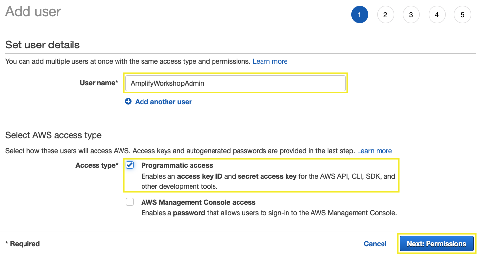

1.4\. Click **Attach permissions policies** and select **Administrator Access**, choose **Next: Tags**.


1.5\. For **Add tags (optional)** section choose **Next: Review**.

1.6\. Click on **Create user**.

1.7\. To save the credentials, choose **Download .csv** and then save the file to a safe location, and **Close**.

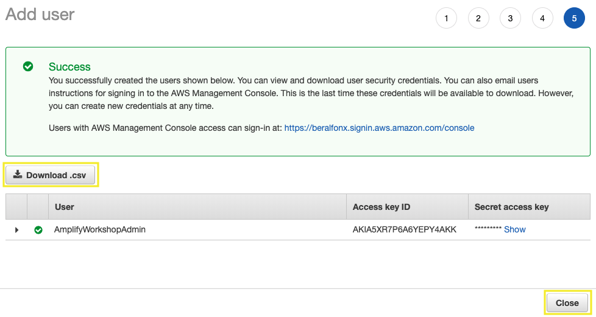

## 2. Create an AWS CodeCommit repository

2.1\. Open the CodeCommit console at https://console.aws.amazon.com/codesuite/codecommit/home.

2.2\. On the **Repositories page**, choose **Create repository**.

2.3\. On the **Create repository** page, in **Repository name** type `react-my-todos` and enter a **Description**, choose **Create**.

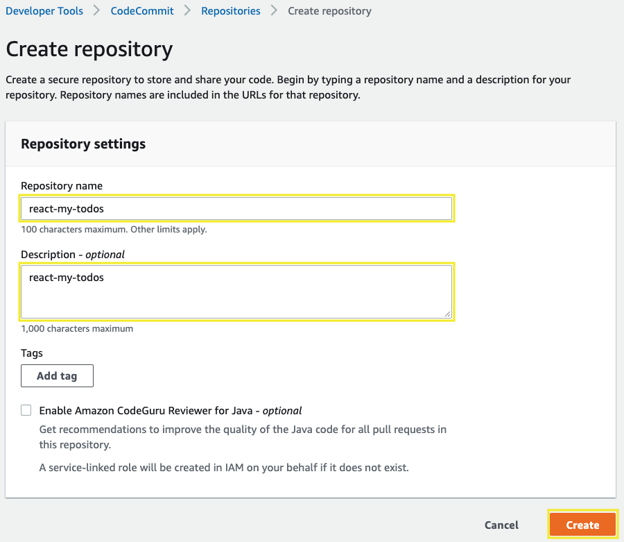

2.4\. From the **Clone URL** drop down, select **Clone HTTPS**, you will use the URL copied later. 

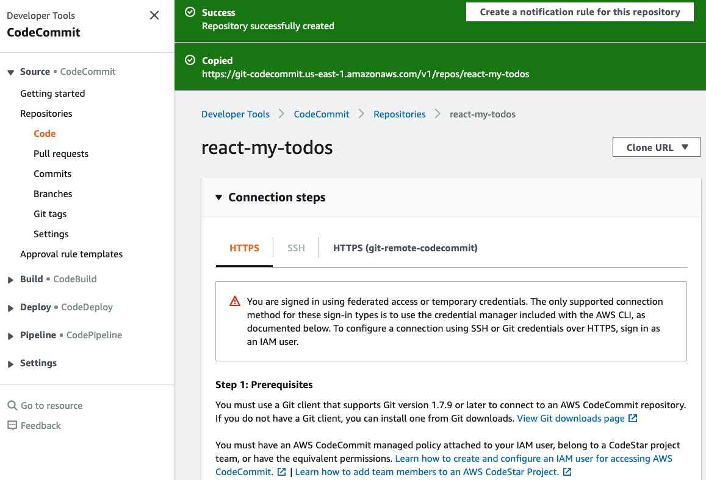

## 3. Create a Cloud9 instance for development

3.1\. Open the AWS Cloud9 console at https://console.aws.amazon.com/cloud9/.

3.2\. Click on **Create environment**.


3.3\. For the **Name** type `amplify-workshop`, and choose **Next step**.

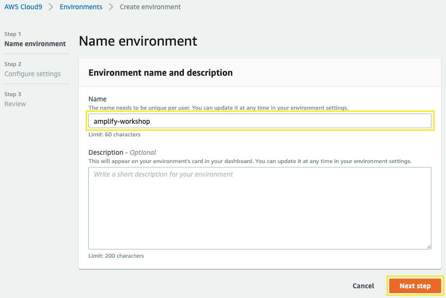

3.4\. For the **Configure settings** section, select the instance type **t3.small** and choose **Next step**.


3.5\. For the **Review** section click on **Create environment**.

3.6\. Wait a few seconds until your development environment is ready, you will see the following screen.

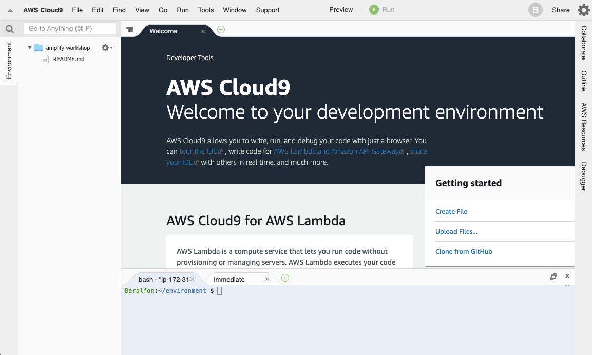

3.7\. For this lab is required to see hidden files, click on preference icon and click on **Show Hidden Files**.

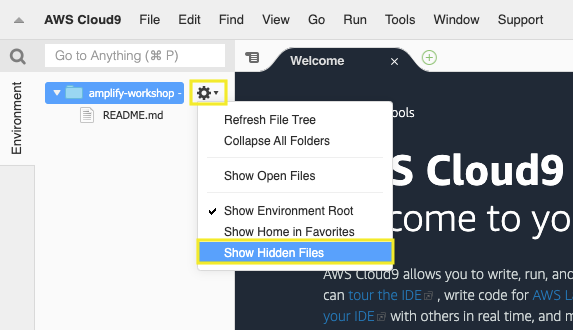

## 4. Configure your AWS CLI with your IAM credentials

4.1\. Inside the Cloud9 environment, click on **AWS Cloud9** and **Preferences**.


4.2\. Select **AWS SETTINGS** and turn off **AWS managed temporary credentials**.

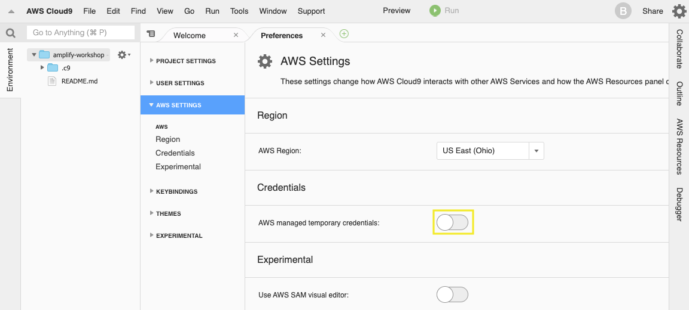

4.3\. In the **bash** terminal we are going to configure the AWS CLI as follows:

``` bash
aws configure
```

- For this configuration use the values inside the **credentials.csv** file previously downloaded.
    - AWS Access Key ID: **(Type your Access key ID)**
    - AWS Secret Access Key: **(Type your Secret access key)**
    - Default region name [None]: **us-east-1** (Use your region code, [all Regions](https://docs.aws.amazon.com/AWSEC2/latest/UserGuide/using-regions-availability-zones.html#concepts-available-regions))
    - Default output format [None]: **json**


4.4\. Remove **aws_session_token** variable from aws credentials.

``` bash
sed -i 's/aws_session_token =//g' ~/.aws/credentials
```

## 5. Configure and run the base React application

5.1\. Inside your **environment** folder clone the repository project from GitHub.

``` bash
cd ~/environment/
git clone --single-branch --branch start https://github.com/aurbac/react-my-todos.git
cd react-my-todos
git branch master
git checkout master
```

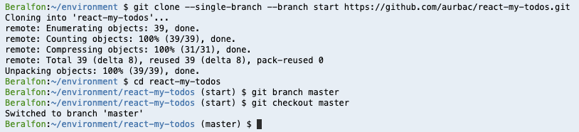

5.2\. Install the Node.js dependencies.

``` bash
npm install
```

5.3\. Run the project.

``` bash
npm start
```

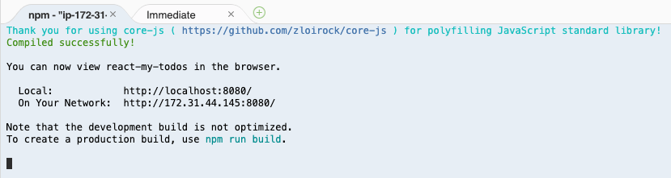

5.4\. Once the web server has started, click the **Preview** menu and select **Preview Running Application**.

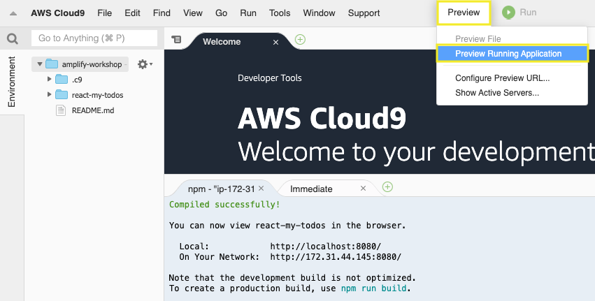

5.5\. If you’d like, you can also pop the preview to a new window.

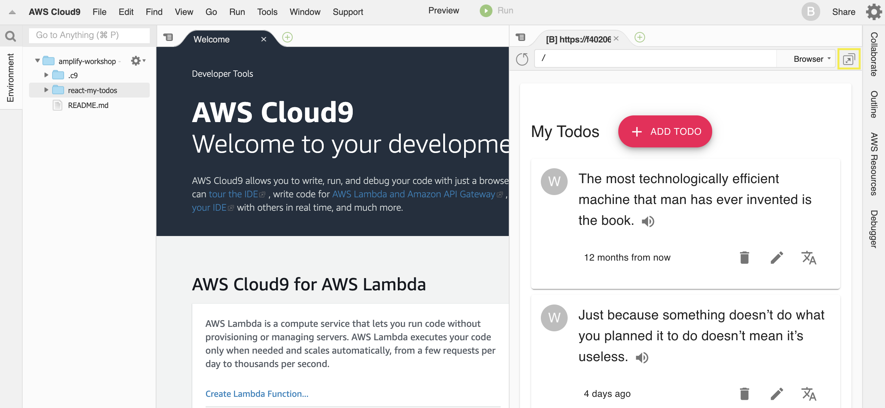

5.6\. Finally, open another terminal window. We’ll leave this first terminal alone since it’s running the web server process.

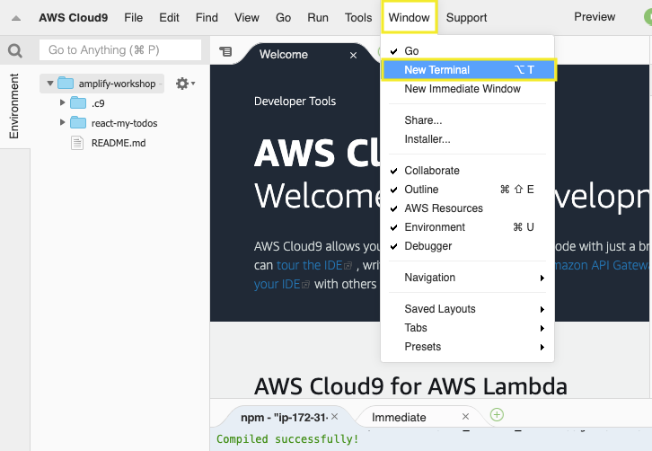

## 6. Using AWS CodeComit repository

6.1\. Your AWS Cloud9 development environment already have IAM credentiales configured, use these credentials with the AWS CLI credential helper. Enable the credential helper by running the following two commands in the terminal of your Cloud9 environment.

``` bash
git config --global credential.helper '!aws codecommit credential-helper $@'
git config --global credential.UseHttpPath true
```

6.2\. Go inside **react-my-todos** folder and remove remote from git project.

``` bash
cd ~/environment/react-my-todos/
git remote remove origin
```

6.3\. Use your repository URL to add your new Git origin to your project, the following command add it depending of the AWS region that you are working on.

``` bash
export MY_REGION=`aws configure get region`
git remote add origin https://git-codecommit.$MY_REGION.amazonaws.com/v1/repos/react-my-todos
```

6.4\. Configure Git with your name and email.

``` bash
git config --global user.name "Your Name"
git config --global user.email you@example.com
```

6.5\. **Adding**, **committing**, and **pushing** files to the CodeCommit repository.

``` bash
git add .
git commit -m "Preparing your development environment"
git push origin master
```

6.6\. Now you can use the CodeCommit console to review the files in a repository or quickly read the contents of a file.

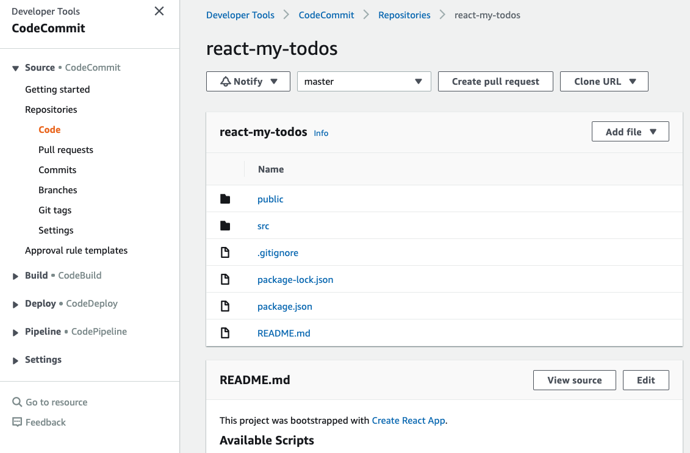